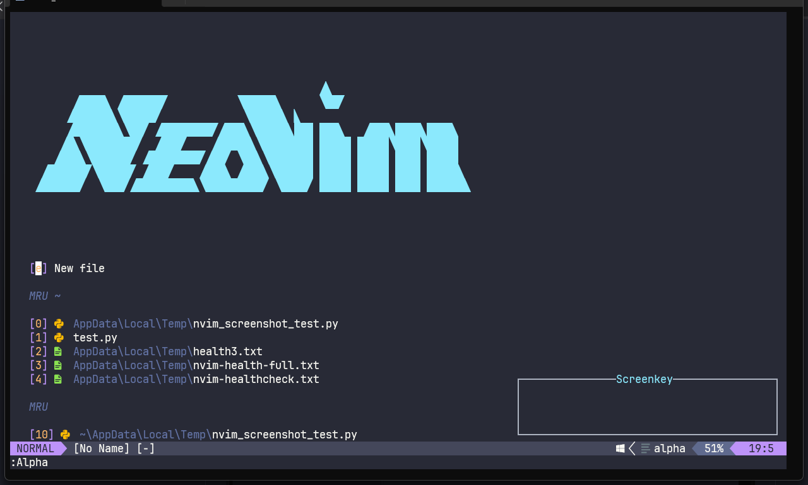
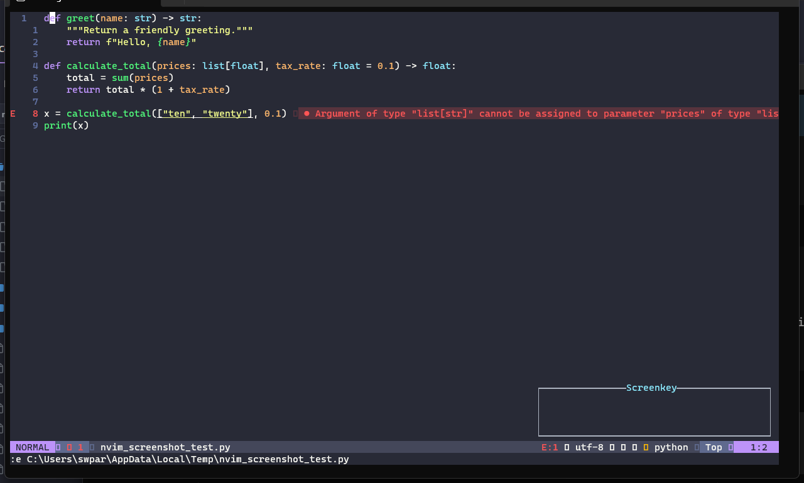
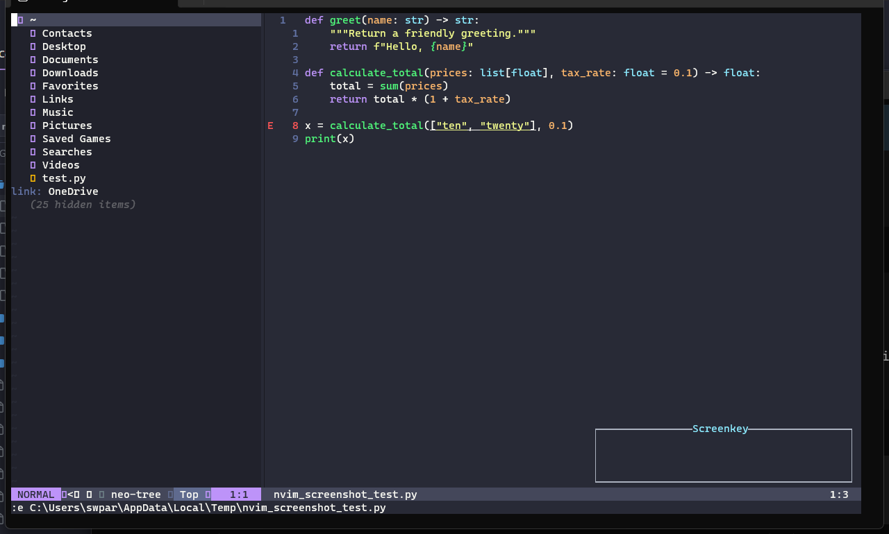
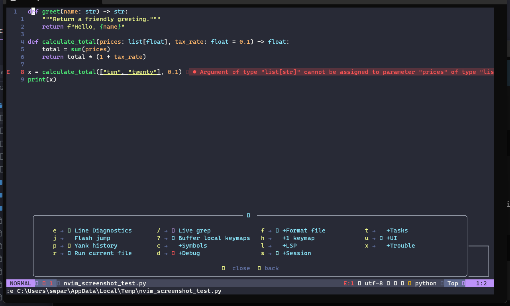
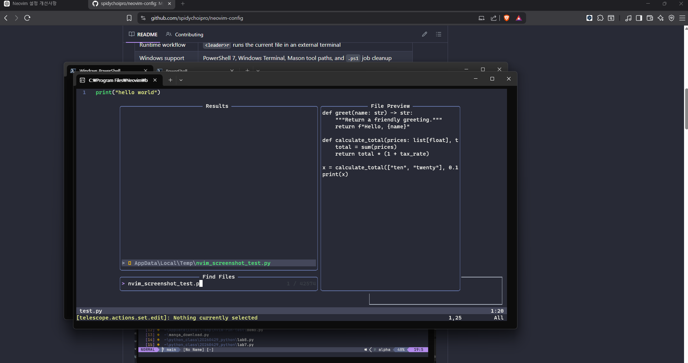

# Neovim 설정 (Neovim Config)

[English Documents](./README.md)

언어 도구 지원, 외부 터미널 실행, 그리고 낮은 진입 장벽의 편집 환경에 초점을 맞춘 깔끔하고 빠르며 IDE와 같은 Neovim 설정입니다.

이 설정은 Neovim을 컨트롤 센터로 취급하며, 프로그램 실행은 실제 외부 터미널에서 유지하도록 설계되었습니다.

## 주요 기능

- **LSP 지원**: Bash, Python, Lua, PowerShell, C, C++ 지원.
- **자동 Python 가상 환경 감지**: (.venv, venv, env).
- **외부 실행 시스템**: `<leader>r`을 통한 즉각적인 외부 터미널 실행.
- **Windows 최적화**: Windows Terminal 및 PowerShell(`pwsh`) 연동.
- **Linux 지원**: 시스템 기본 터미널을 통한 실행 지원.
- **경량 Git 연동**: Gitsigns를 통한 Hunk 관리 및 블레임 지원.
- **향상된 디버깅 환경**: Dap UI 및 자동 감지 지원.
- **프로젝트 전역 탐색**: Trouble 및 Telescope 통합.
- **포맷팅**: `conform.nvim`을 통한 자동 코드 정렬.
- **린팅**: `nvim-lint`를 통한 정적 코드 분석.
- **세션 관리**: `auto-session`을 통한 작업 상태 자동 저장 및 복구.
- **작업 관리**: `overseer.nvim`을 통한 빌드 및 테스트 자동화.
- **직관적 단축키**: `which-key.nvim`을 통한 가시적인 단축키 가이드.
- **PowerShell 최적화**: `powershell.nvim`을 통한 강력한 스크립팅 환경.

## 철학

- **외부 터미널 우선**: 내부 터미널의 복잡함 대신 실제 터미널 환경을 활용합니다.
- **최소주의 및 강력함**: 불필요한 기능은 배제하되 필요한 기능은 강력하게 지원합니다.
- **안정성 및 예측 가능성**: 유지보수를 위해 복잡한 추상화를 최소화합니다.
- **비대하지 않은 IDE 환경**: IDE의 편리함을 제공하되 Neovim 본연의 속도를 유지합니다.

## 단축키 (Keybindings)

### 일반 (General)

| 단축키 | 동작 |
| --- | --- |
| `<leader>r` | 외부 터미널에서 현재 파일 실행 |
| `<leader>f` | 현재 파일 포맷팅 (코드 정렬) |
| `<leader>/` | 전체 텍스트 검색 (Live Grep) |
| `<leader>?` | 버퍼 로컬 단축키 확인 |
| `<C-p>` | 파일 검색 |
| `<C-n>` | 파일 탐색기 열기/닫기 |

### Git (`<leader>g`)

| 단축키 | 동작 |
| --- | --- |
| `]c` | 다음 Hunk로 이동 |
| `[c` | 이전 Hunk로 이동 |
| `<leader>gs` | Hunk 스테이징 |
| `<leader>gr` | Hunk 리셋 |
| `<leader>gp` | Hunk 미리보기 |
| `<leader>gb` | 라인 블레임(Blame) 확인 |

### 디버깅 (`<leader>d`)

| 단축키 | 동작 |
| --- | --- |
| `<leader>db` | 브레이크포인트 토글 |
| `<leader>dc` | 디버그 세션 계속(Continue) |
| `<leader>di` | Step Into |
| `<leader>do` | Step Over |
| `<leader>du` | DAP UI 토글 |
| `<leader>dx` | 디버그 세션 종료 |

### 작업 (`<leader>t`)

| 단축키 | 동작 |
| --- | --- |
| `<leader>tr` | Overseer 작업 실행 |
| `<leader>tb` | Overseer 빌드 작업 실행 |
| `<leader>tt` | Overseer 작업 목록 토글 |
| `<leader>ta` | Overseer 작업 액션 |

### Trouble (`<leader>x`)

| 단축키 | 동작 |
| --- | --- |
| `<leader>xx` | 진단 정보 (Trouble) |
| `<leader>xX` | 버퍼 진단 정보 (Trouble) |
| `<leader>xQ` | Quickfix 목록 (Trouble) |
| `<leader>xL` | Location 목록 (Trouble) |
| `<leader>cl` | LSP 심볼 / 참조 (Trouble) |

## Python 가상 환경 (Virtual Environments)

이 설정은 프로젝트 루트에 있는 Python 가상 환경을 자동으로 감지하고 사용합니다:
- `.venv`
- `venv`
- `env`

다음 기능들과 연동됩니다:
- LSP (`basedpyright`)
- DAP (`debugpy`)
- 외부 실행기 (`<leader>r`)

## Overseer 워크플로우

Overseer는 작업 관리에 사용됩니다. 모든 작업은 백그라운드 작업으로 실행되며 출력이 캡처됩니다.

- 작업 출력 창에서 `Enter`를 누르면 창이 닫힙니다.
- `q`를 누르면 작업 목록이나 상세 창이 닫힙니다.
- 작업 완료 후 불필요한 프로세스가 남지 않습니다.

## 외부 실행 시스템 (External Run System)

`<leader>r`을 누르면 새 외부 터미널 창에서 현재 파일이 실행됩니다.

지원되는 파일 형식:

| 언어 | 실행 명령 |
| --- | --- |
| Python | `py file.py` (Windows) 또는 `python file.py` |
| Lua | `lua` 또는 `luajit` 기반 실행 |
| Bash | `bash file.sh` |
| PowerShell | `pwsh file.ps1` |
| C | `clang` 컴파일 후 실행 |
| C++ | `clang++` 컴파일 후 실행 |

실행 규칙:
- 파일이 위치한 디렉토리에서 실행됩니다.
- 공백이 포함된 경로를 지원합니다.
- Neovim을 차단(Block)하지 않습니다.
- 실행 실패 시에만 터미널이 열려 있고, 성공 시 자동으로 닫힙니다.

## 요구 사항

- Neovim v0.11 이상
- Git
- Node.js 및 npm
- Python
- PowerShell 7 이상 (`pwsh`)
- Windows Terminal (`wt.exe`, Windows 전용)
- Linux 터미널 (`x-terminal-emulator`, `gnome-terminal`, `konsole`, `alacritty`, `kitty`, `wezterm`, `xterm` 등)
- `clang` 및 `clang++`
- `bash` 또는 `sh`

Mason을 통해 다음 도구들이 자동/수동으로 관리됩니다:
- `lua-language-server`, `basedpyright`, `bash-language-server`, `powershell-editor-services`, `clangd`
- `clang-format`, `debugpy`, `codelldb`, `black`, `isort`, `stylua`, `shellcheck`, `shfmt`

## 설치 방법

### Windows

```powershell
git clone https://github.com/spidychoipro/neovim-config "$env:LOCALAPPDATA\nvim"
```

기존 설정이 있다면 먼저 백업하세요:
```powershell
Rename-Item "$env:LOCALAPPDATA\nvim" "$env:LOCALAPPDATA\nvim.backup"
git clone https://github.com/spidychoipro/neovim-config "$env:LOCALAPPDATA\nvim"
```

### Linux

```bash
git clone https://github.com/spidychoipro/neovim-config ~/.config/nvim
```

기존 설정이 있다면 먼저 백업하세요:
```bash
mv ~/.config/nvim ~/.config/nvim.backup
git clone https://github.com/spidychoipro/neovim-config ~/.config/nvim
```

## 스크린샷










